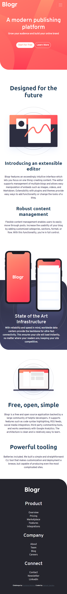
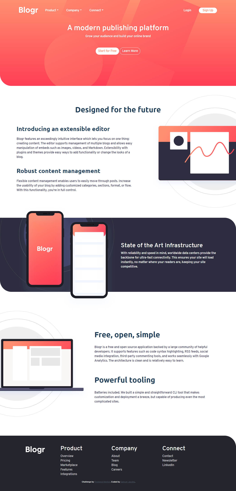

# Frontend Mentor - Blogr landing page solution

This is a solution to the [Blogr landing page challenge on Frontend Mentor](https://www.frontendmentor.io/challenges/blogr-landing-page-EX2RLAApP). Frontend Mentor challenges help you improve your coding skills by building realistic projects. 

## Table of contents

- [Overview](#overview)
  - [The challenge](#the-challenge)
  - [Screenshot](#screenshot)
  - [Links](#links)
- [My process](#my-process)
  - [Built with](#built-with)
  - [Continued development](#continued-development)
  - [Useful resources](#useful-resources)
- [Author](#author)

## Overview

### The challenge

Users should be able to:

- View the optimal layout for the site depending on their device's screen size
- See hover states for all interactive elements on the page

### Screenshot

### Links

- Solution URL: [Github Repository](https://github.com/Samuel-jacobs/Blogr)
- Live Site URL: [samuel-jacobs.github.io/Blogr](https://samuel-jacobs.github.io/Blogr/)

## My process

### Built with

- Semantic HTML5 markup
- CSS custom properties
- Bootstrap4
- Mobile-first workflow

### Continued development

I'll like to work more on javascript projects. I'll also like to learn about react and use it for subsequent projects

### Useful resources

- [resource 1](https://www.w3schools.com) - This tutorial website helped me when i got stuck with a css syntax or 
- [resource 2](https://www.stackoverflow.com) - Thid forum helped me see how to solve problems i came accross while working on the project

## Author

- Website - [Samuel Jacobs](https://samueljacobs.netlify.app)
- Frontend Mentor - [@Samuel-jacobs](https://www.frontendmentor.io/profile/Samuel-jacobs)
- Twitter - [@_samueljacobs_](https://www.twitter.com/_samueljacobs_)

